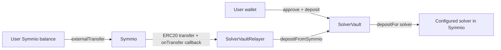
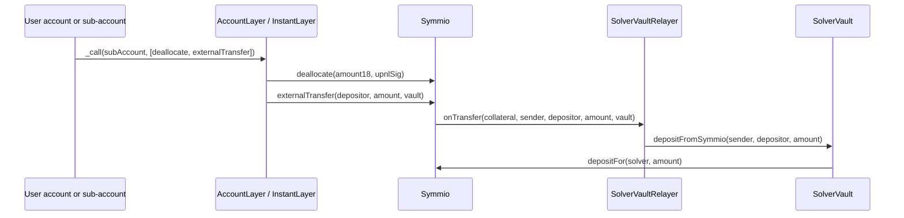
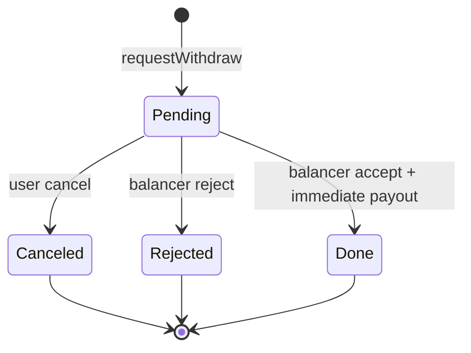

# Solver Deposit Vault

`SolverVault` lets users deposit collateral for a configured Symmio solver while keeping per-user vault accounting. Every
accepted deposit is forwarded to Symmio with `depositFor(solver, amount)`.

The vault supports two deposit paths:

- **Wallet deposit:** the user approves collateral to the vault and calls `deposit(amount)`.
- **Symmio deposit:** the user calls Symmio `externalTransfer(...)`; Symmio routes collateral through
  `SolverVaultRelayer`, which credits the vault deposit.

## Roles

- `DEFAULT_ADMIN_ROLE`: authorizes UUPS upgrades and role administration.
- `SETTER_ROLE`: updates Symmio address, solver address, and deposit limit.
- `SYMMIO_RELAYER_ROLE`: allowed to call `depositFromSymmio(...)`.
- `BALANCER_ROLE`: accepts or rejects withdrawal requests and can sweep excess collateral.
- `PAUSER_ROLE` / `UNPAUSER_ROLE`: pause and resume user-facing vault actions.

## Depositing



`depositFromSymmio(...)` is restricted to `SYMMIO_RELAYER_ROLE`; users should not call it directly.

### From Wallet Funds

1. Approve the vault to spend the collateral token.
2. Call `SolverVault.deposit(amount)`.
3. The vault credits `depositedBalances[msg.sender]` and forwards the amount to Symmio for `solver`.

### From Symmio Funds

Use Symmio `externalTransfer(depositor, amount, vault)` when the funds are already inside Symmio.

Before users can use this path, a Symmio integration admin must register the route:

```solidity
addRelayerForExternalTransferTarget(solverVault, solverVaultRelayer);
```

The vault admin must also grant `SYMMIO_RELAYER_ROLE` to that same `solverVaultRelayer`.

Before calling `externalTransfer(...)`, make sure the balance is available in the account that will execute the transfer:

- If funds are allocated, deallocate first.
- If funds sit on a custom sub-account or virtual account, execute the batch in that account context.

For a custom sub-account with allocated funds, use AccountLayer `CoreFacet._call(address account, bytes[] callDatas)`
with the Symmio core calls encoded in order:

```ts
// Symmio: deallocate(uint256 amount, SingleUpnlSig upnlSig)
const deallocateCall = symmio.interface.encodeFunctionData("deallocate", [amount18, upnlSig]);
// Or use safeDeallocate(amount18, upnlWithPendingBalanceSig) when pending balance must be included.

// Symmio: externalTransfer(address receiver, uint256 amount, address target)
const externalTransferCall = symmio.interface.encodeFunctionData("externalTransfer", [depositor, amountInCollateralDecimals, solverVault]);

await accountLayer._call(subAccount, [deallocateCall, externalTransferCall]);
```

With InstantLayer, submit the same two Symmio calls as signed operations to
`InstantLayer.executeBatch(signedOps, signatures, fills, flexFillerSignatures)`.

If the funds are already available, skip `deallocate(...)` and only include `externalTransfer(...)`. The vault deposit is
triggered by `externalTransfer(...)`; `internalTransfer(...)` is not used for this path.



## Withdrawals

Withdrawals are request based because solver collateral may need to be rebalanced before paying users back.

1. The user calls `requestWithdraw(amount, minAmountOut, receiver)`.
2. The request amount is marked pending and no longer available for another request.
3. A balancer accepts the request with `acceptWithdrawRequest(providedAmount, requestIds, acceptedAmounts)`.
4. On accept, the vault immediately transfers each accepted amount to the request receiver and marks the request `Done`.

There is no separate user claim step. Once the balancer accepts a request, payout happens in the same transaction.



## Admin And Operations

- `setSymmioAddress(address)`: updates the Symmio contract, but rejects collateral-token changes after initialization.
- `setSolver(address)`: updates the solver account that receives forwarded Symmio deposits.
- `setDepositLimit(uint256)`: caps total active vault deposits.
- `sweepCollateral(receiver, amount)`: lets the balancer sweep excess collateral that is not needed for immediate
  withdrawal payouts.
- `pause()` / `unpause()`: pause or resume deposits, withdrawals, accepts, rejects, and sweeps.

## Development

The project uses Hardhat 3. `SolverVault` is deployed behind an ERC1967 proxy and upgrades through UUPS, with
`DEFAULT_ADMIN_ROLE` authorizing implementation upgrades.

```shell
npm test
```
